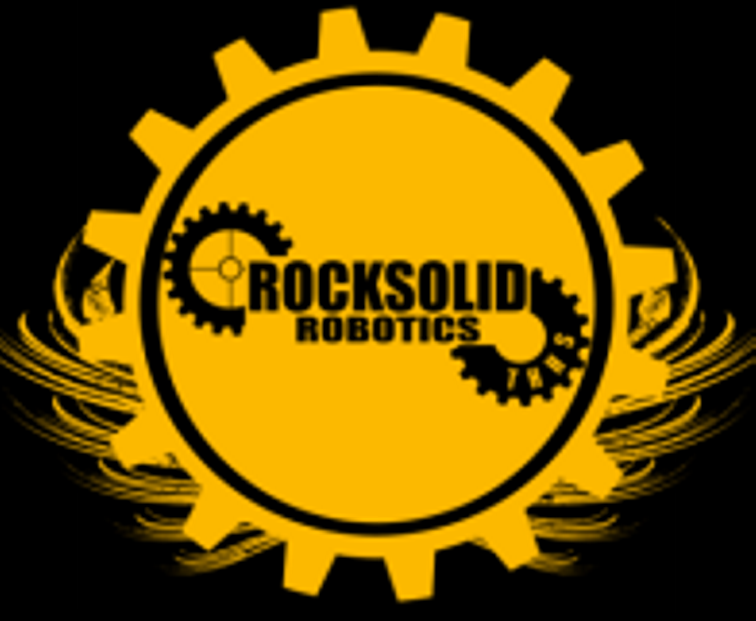

# FRC_code - Rock Solid Robotics - 4656
This is the code for the FRC Robotics team I am on, Rock Solid Robotics.

## About
This year Rock Solid Robotics has decided to write most of our code for the
year is C++. Previously, our team has used Java and Labview. 

## Contents
This repository contains all of our custom development tools, libraries, build
systems, and production code.

## Organization
* CAD - contains some of the public CAD projects we are working on.
* production - contains our actual production code being deployed to the robot.
* libraries - contains our vendor and *Custom Build* libraries.
* / - contains config and general information.
* doc - see section Doc
* experiment - contains all of our experiments and some of our testing /
programming notebooks.

## Doc
This contains more public information about our coding projects.
